# Interactive 3D Living Room Simulator - Architecture Document

## Table of Contents
1. [Application Overview](#application-overview)
2. [Main Components](#main-components)
3. [Data Models](#data-models)
4. [Core Workflows](#core-workflows)
5. [Technology Stack](#technology-stack)
6. [Architecture Diagrams](#architecture-diagrams)
7. [Performance Considerations](#performance-considerations)
8. [Future Enhancements](#future-enhancements)

## Application Overview

### Purpose
The Interactive 3D Living Room Simulator is a web-based application that provides users with an immersive, ultra-realistic 3D environment for interior design visualization and furniture arrangement. The application enables real-time manipulation of furniture objects within a photorealistic living room setting.

### Key Features
- **Ultra-realistic 3D rendering** with advanced lighting and post-processing effects
- **Interactive furniture manipulation** with drag-and-drop functionality
- **Real-time lighting simulation** including natural window light and artificial lighting
- **Material simulation** with physically-based rendering (PBR) materials
- **Environmental reflections** for enhanced realism
- **Responsive camera controls** for comprehensive scene exploration

### Target Users
- Interior designers and architects
- Homeowners planning room layouts
- Furniture retailers for product visualization
- Students learning 3D design concepts

## Main Components

### Frontend Components

#### 1. Scene Manager
- **Responsibility**: Core 3D scene initialization and management
- **Key Functions**: Scene setup, camera configuration, renderer initialization
- **Dependencies**: Three.js core library

#### 2. Rendering Engine
- **Responsibility**: Visual output generation with advanced effects
- **Key Functions**: Post-processing pipeline, shadow mapping, tone mapping
- **Dependencies**: Three.js post-processing modules

#### 3. Lighting System
- **Responsibility**: Realistic lighting simulation
- **Key Functions**: Multiple light types management, shadow casting
- **Dependencies**: RectAreaLightUniformsLib

#### 4. Material System
- **Responsibility**: Realistic surface appearance
- **Key Functions**: Texture generation, PBR material creation
- **Dependencies**: Canvas API for procedural textures

#### 5. Furniture Factory
- **Responsibility**: 3D furniture object creation and management
- **Key Functions**: Geometry generation, material assignment, positioning
- **Dependencies**: Three.js geometry classes

#### 6. Interaction Controller
- **Responsibility**: User input handling and object manipulation
- **Key Functions**: Drag controls, orbit controls, event management
- **Dependencies**: Three.js control libraries

#### 7. UI Layer
- **Responsibility**: User interface and instructions display
- **Key Functions**: Control instructions, responsive layout
- **Dependencies**: CSS, HTML5

### Backend Components
**Note**: This is a client-side only application with no backend infrastructure.

### Database
**Note**: No persistent data storage is implemented. All scene state is maintained in memory.

### External Integrations
- **Three.js CDN**: Core 3D graphics library
- **Google Fonts**: Typography (Inter font family)

## Data Models

### Scene Data Model
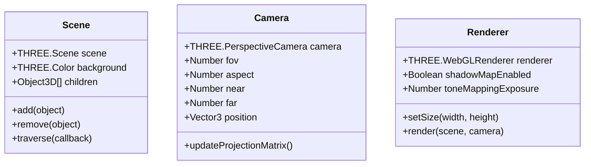

### Furniture Data Model
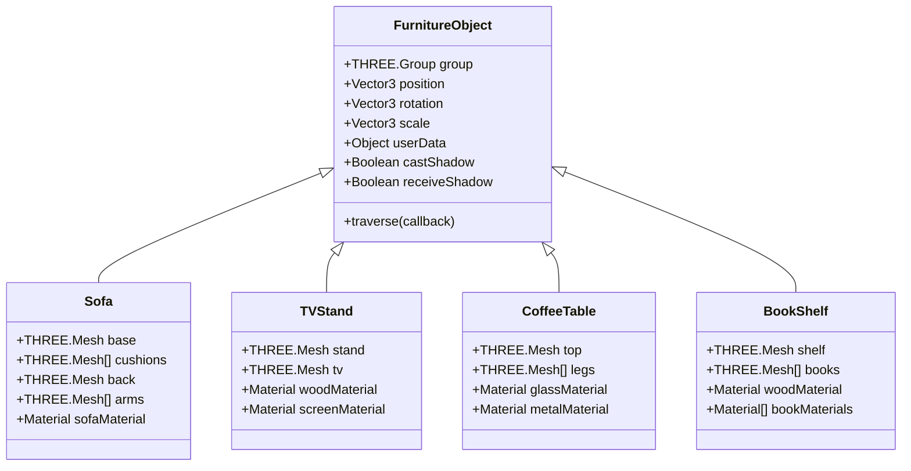

### Material Data Model
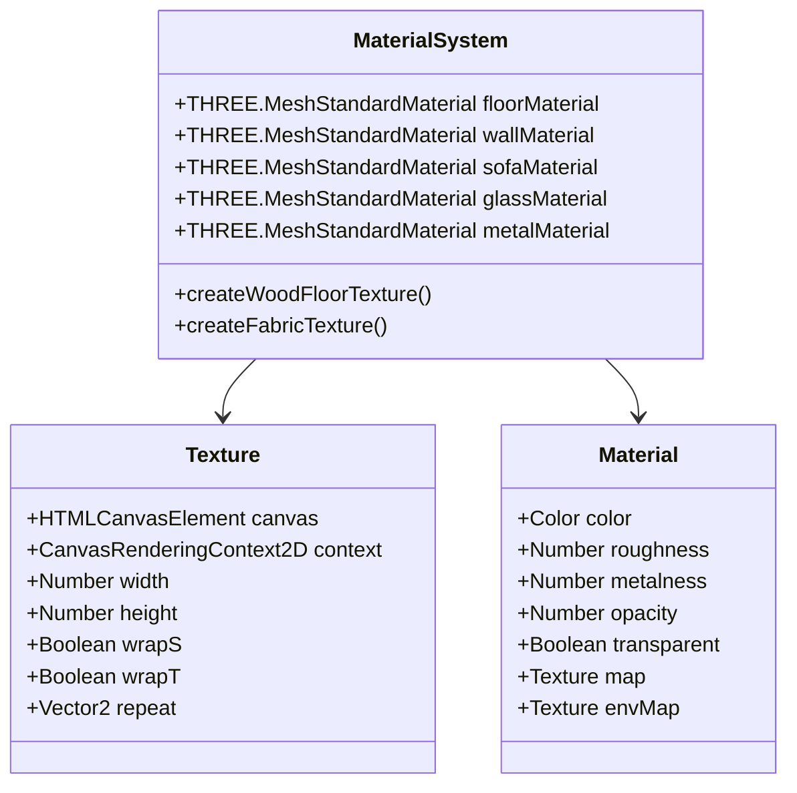

### Lighting Data Model
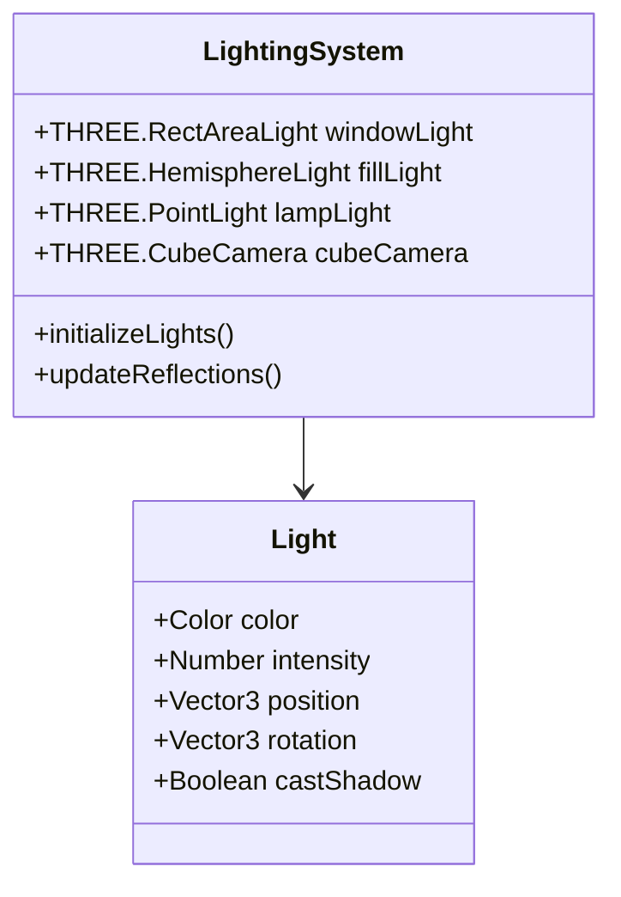

## Core Workflows

### Application Initialization Workflow
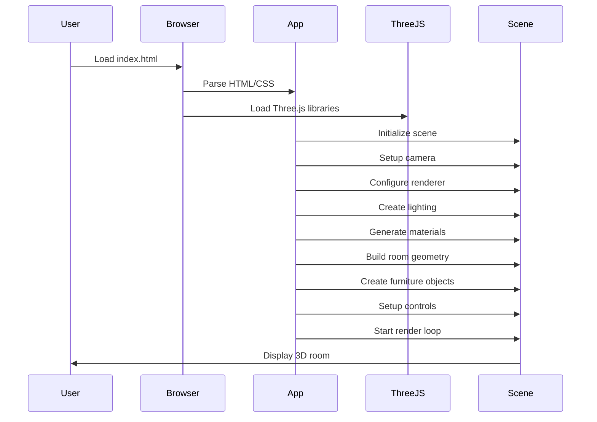

### Furniture Interaction Workflow
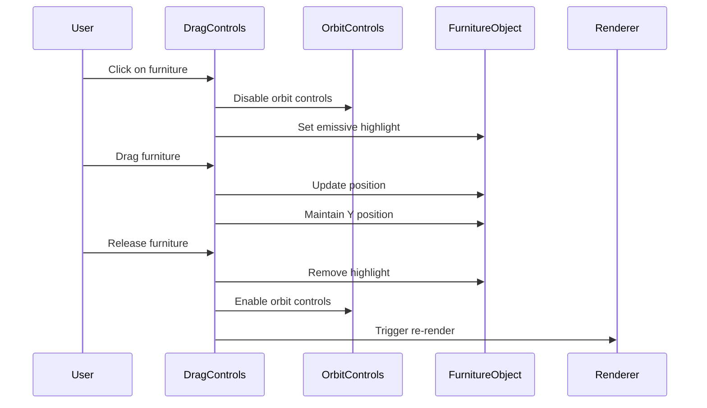

### Rendering Pipeline Workflow
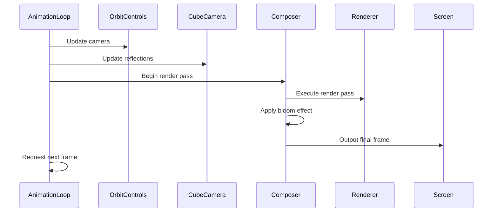

### Texture Generation Workflow
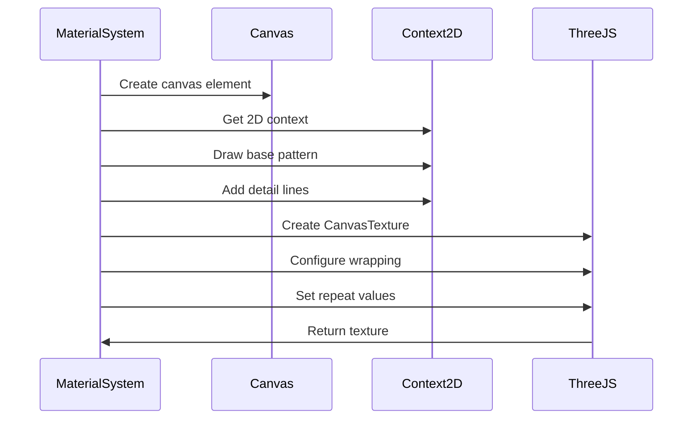

## Technology Stack

### Frontend Technologies

#### Core Libraries
| Technology | Version | Purpose |
|------------|---------|---------|
| **Three.js** | r128 | 3D graphics rendering and scene management |
| **HTML5** | Latest | Document structure and canvas element |
| **CSS3** | Latest | Styling and responsive layout |
| **JavaScript** | ES6+ | Application logic and interaction handling |

#### Three.js Modules
| Module | Purpose |
|--------|---------|
| **OrbitControls** | Camera manipulation and scene navigation |
| **DragControls** | Object selection and movement |
| **EffectComposer** | Post-processing pipeline management |
| **RenderPass** | Basic scene rendering |
| **UnrealBloomPass** | Bloom lighting effects |
| **RectAreaLightUniformsLib** | Advanced lighting calculations |

#### External Dependencies
| Service | Purpose |
|---------|---------|
| **Google Fonts CDN** | Inter font family for UI typography |
| **Three.js CDN** | Library delivery and version management |

### Runtime Environment
- **Browser**: Modern web browsers with WebGL support
- **WebGL**: Hardware-accelerated 3D graphics
- **Canvas API**: 2D texture generation
- **RequestAnimationFrame**: Smooth animation loops

### Development Tools
- **No build process**: Direct HTML/CSS/JS development
- **CDN delivery**: No local dependency management required
- **Hot reload**: Browser refresh for development iterations

## Architecture Diagrams

### High-Level System Architecture
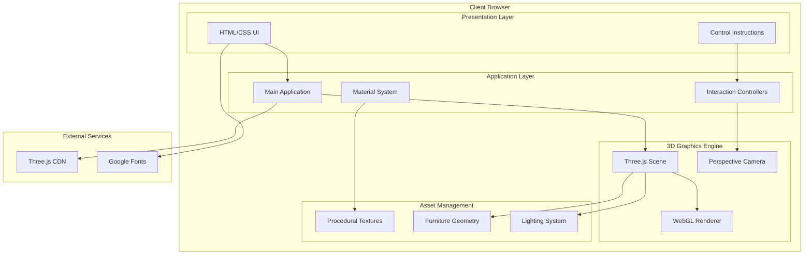

### Component Interaction Diagram
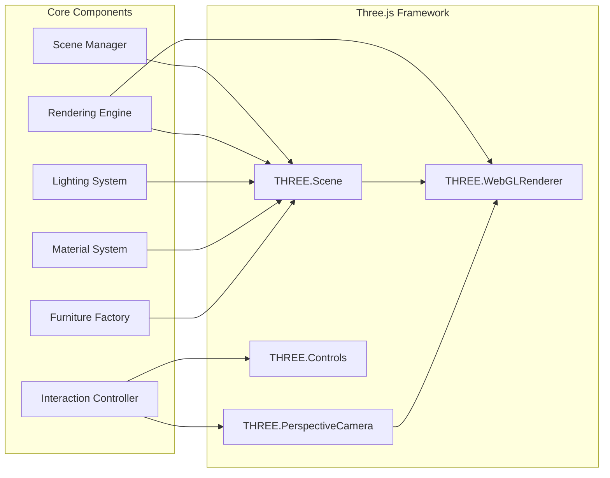

### Data Flow Diagram
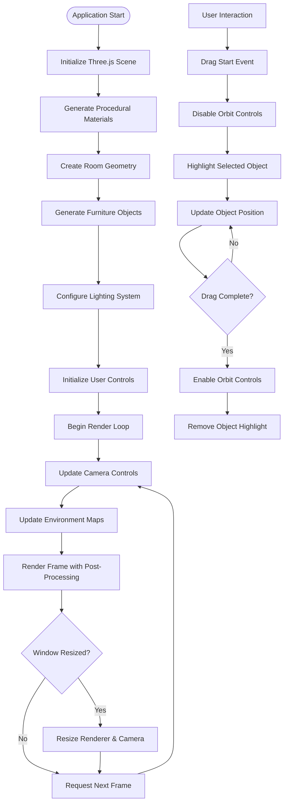

### Scene Hierarchy Diagram
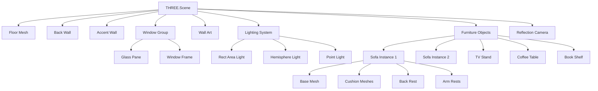

## Performance Considerations

### Rendering Optimization
- **Shadow Map Resolution**: Optimized for balance between quality and performance
- **Post-Processing**: Selective bloom effects with configurable thresholds
- **Geometry Optimization**: Efficient polygon counts for furniture objects
- **Texture Resolution**: Balanced texture sizes for visual quality vs. memory usage

### Memory Management
- **Geometry Reuse**: Shared geometries for similar objects (sofa instances)
- **Material Sharing**: Common materials across multiple objects
- **Texture Caching**: Procedural textures generated once and reused
- **Garbage Collection**: Proper cleanup of Three.js objects when needed

### Browser Compatibility
- **WebGL Support**: Requires modern browsers with WebGL capabilities
- **Hardware Acceleration**: Benefits from dedicated GPU rendering
- **Mobile Considerations**: Responsive design but optimized for desktop interaction

## Future Enhancements

### Planned Features
1. **Furniture Library**: Expandable catalog of furniture types
2. **Room Customization**: Configurable room dimensions and layouts
3. **Material Editor**: User-customizable material properties
4. **Scene Persistence**: Save and load room configurations
5. **VR Support**: Virtual reality integration for immersive experience
6. **Lighting Controls**: User-adjustable lighting scenarios
7. **Collision Detection**: Realistic furniture placement constraints
8. **Physics Integration**: Realistic object interactions and gravity

### Technical Improvements
1. **Performance Optimization**: LOD (Level of Detail) system for complex furniture
2. **Asset Loading**: External 3D model support (GLTF/GLB)
3. **Progressive Enhancement**: Graceful degradation for lower-end devices
4. **Accessibility**: Screen reader support and keyboard navigation
5. **Testing Framework**: Automated testing for 3D scene functionality

### Architecture Evolution
1. **Modular Design**: Plugin architecture for extending functionality
2. **State Management**: Redux-like state management for complex interactions
3. **Component System**: Entity-Component-System architecture for scalability
4. **Backend Integration**: Server-side scene persistence and user accounts
5. **Real-time Collaboration**: Multi-user room design sessions

---

*Document Version: 1.0*  
*Last Updated: June 26, 2025*  
*Architecture Team: Senior Software Architect*
